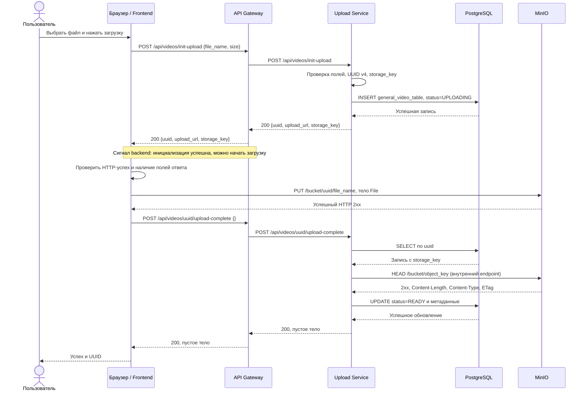

# API Specification: Frontend, API Gateway, Upload Service

Дата сверки с исходным кодом: 2026-09-05.

Документ описывает реализованный в репозитории контракт загрузки видео. Источники истины: обработчики HTTP, frontend-клиент, SQL-схема и Docker Compose. Это описание текущей реализации, а не проект будущего API. Адреса и имена бакетов ниже приведены для значений по умолчанию в Compose; окружение может их переопределять. Проверка выполнена по исходникам, без запуска интеграционного сценария.

## 1. Компоненты и границы ответственности

| Компонент | Ответственность | Данные |
| --- | --- | --- |
| Frontend: React + TypeScript | Выбор файла, инициализация, прямой PUT в MinIO, подтверждение, отображение прогресса | `File`, статус UI, процент, ошибка и UUID в памяти React; постоянного хранения нет |
| Frontend nginx | Раздача собранного приложения и SPA fallback | Статические файлы сборки; API не проксирует |
| API Gateway | Проксирование `/api/videos/` в Upload Service, CORS, health, access logs | Собственной БД, сессий или кеша нет |
| Upload Service | Создание UUID и записи видео, проверка объекта через HEAD, обновление статуса | Читает и пишет `general_video_table`; не принимает байты видео |
| PostgreSQL | Состояние видео и метаданные оригинала | `general_video_table`, заготовка `meta_video_table` |
| MinIO | Хранение бинарных объектов | Оригиналы видео; ещё два бакета созданы для будущих артефактов |
| Redis | Поднят в Compose | В данном сценарии не используется; ключей, очередей и сессий код не создаёт |

Файл передаётся по отдельному пути **браузер → MinIO**. Через **браузер → Gateway → Upload Service** проходят только управляющие запросы. Браузер не обращается к PostgreSQL; Gateway не обращается к PostgreSQL или MinIO.

## 2. Адреса и конфигурация

| Назначение | С хост-машины / из браузера | В сети Compose |
| --- | --- | --- |
| Frontend | `http://localhost:3000` | `http://frontend:80` |
| API Gateway | `http://localhost:8080` | `http://api_gateway:8080` |
| Upload Service | `http://localhost:8081` | `http://upload_service:8081` |
| MinIO S3 API | `http://localhost:9000` | `http://s3-storage:9000` |
| MinIO console | `http://localhost:9001` | `http://s3-storage:9001` |
| PostgreSQL | `localhost:5432` | `postgres:5432` |

Порт `9001` предназначен для консоли, загрузка и HEAD идут на S3 API `9000`. Порт Upload Service опубликован в Compose, хотя frontend использует Gateway. При запуске через Vite адрес frontend по умолчанию `http://localhost:5173`.

| Переменная | Потребитель | Назначение / значение в Compose по умолчанию |
| --- | --- | --- |
| `VITE_API_BASE_URL` | Frontend, при сборке | `http://localhost:8080`; база управляющих запросов |
| `API_GATEWAY_ADDRESS` | Gateway | `:8080`; адрес прослушивания |
| `UPLOAD_SERVICE_URL` | Gateway | `http://upload_service:8081`; target reverse proxy |
| `UPLOAD_SERVICE_ADDRESS` | Upload Service | `:8081`; адрес прослушивания |
| `DATABASE_URL` | Upload Service | Строка подключения к PostgreSQL; в Compose направлена на `postgres:5432`, БД по умолчанию `prom_app` |
| `MINIO_INTERNAL_ENDPOINT` | Upload Service, s3_init | `http://s3-storage:9000`; внутренний endpoint |
| `MINIO_PUBLIC_ENDPOINT` | Upload Service | `http://localhost:9000`; используется в возвращаемом браузеру `upload_url` |
| `MINIO_ORIGINALS_BUCKET` | Upload Service, s3_init | `video-originals-prom` |
| `MINIO_DERIVED_BUCKET` | s3_init | `video-derived-prod` |
| `MINIO_DETECTIONS_BUCKET` | s3_init | `video-detections-prod` |

Без Compose Go-конфиги используют `localhost:8081` для target Gateway и `localhost` для PostgreSQL/MinIO. Публичные адреса должны быть доступны именно с машины браузера: `localhost` при удалённом открытии приложения будет означать компьютер пользователя.

Если `VITE_API_BASE_URL` не задан, frontend строит относительные `/api/...` URL. В существующих nginx и Vite конфигурациях API proxy отсутствует, поэтому для такого режима требуется отдельная настройка маршрутизации. Изменение build-переменной в уже собранном frontend требует пересборки.

## 3. Полный порядок загрузки



Диаграмма показывает успешную ветку. При разных origin браузер также выполняет CORS preflight `OPTIONS` перед JSON POST и прямым PUT; разрешённые preflight могут кешироваться браузером. Gateway отвечает на свои OPTIONS самостоятельно. OPTIONS для MinIO идёт непосредственно в MinIO.

1. Выбор файла не вызывает API. HTML-поле имеет `accept="video/*"`, но проверки содержимого видео нет.
2. `init-upload` создаёт запись в PostgreSQL. На этом шаге объект в MinIO не создаётся, доступность хранилища не проверяется.
3. Backend возвращает через Gateway `200 OK` с `uuid`, `upload_url`, `storage_key`: это сигнал frontend, что инициализация успешна и можно начинать передачу файла. Frontend ждёт ответ через `await initVideoUpload`, проверяет HTTP-успех и наличие трёх полей и только затем делает один PUT всего файла через `XMLHttpRequest`. При ошибке init PUT не запускается. Прогресс основан на `xhr.upload.onprogress`.
4. Только после успешного PUT frontend вызывает `upload-complete`. Процент `100%` ещё не означает успешное подтверждение в БД.
5. Upload Service проверяет объект посредством HEAD, сохраняет его метаданные и выставляет `READY`.
6. `READY` означает успешную HEAD-проверку и выполнение UPDATE на момент подтверждения. Это не результат декодирования, анализа или детекции видео.

### Сигнал «загрузка возможна»: что именно подтверждает backend

Этот шаг реализован ответом на `POST /api/videos/init-upload`. Отдельного запроса, события или поля `can_upload` / `allowed` нет. Порядок в backend: проверка JSON, непустого имени и положительного размера → генерация UUID → INSERT со статусом UPLOADING → ответ `200 OK` с параметрами загрузки. После INSERT дополнительных проверок перед ответом нет. UPLOADING в БД на этом этапе означает созданную запись ожидаемой загрузки: передача байтов ещё не началась.

Frontend последовательно выполняет `await initVideoUpload(selectedFile)` и затем `await uploadVideoToStorage(...)` в одном обработчике нажатия кнопки. Между ними не требуется повторное действие пользователя. Сигналом продолжения для клиента является успешный HTTP-ответ (проверка `response.ok`) с ожидаемыми полями; backend в этой ветке возвращает именно 200. При неуспешном HTTP-ответе, ошибке разбора JSON или отсутствии любого из трёх полей выполнение попадает в обработчик ошибки и до PUT не доходит.

Нужно различать два этапа проверки: **до загрузки** backend валидирует входные данные и успешно создаёт запись; **после загрузки** на `upload-complete` проверяет существование объекта и получает его метаданные через HEAD. Первый ответ не подтверждает доступность MinIO, права на PUT, свободное место или корректность содержимого видео: таких предварительных проверок нет. Это сигнал продолжения сценария для штатного frontend, а не отдельное разрешение доступа, проверяемое MinIO при PUT.

Основания: [InitUpload](prom_app/services/upload_service/internal/handler/video.go), [проверка ответа в videoApi.ts](prom_app/frontend/src/api/videoApi.ts), [порядок await в App.tsx](prom_app/frontend/src/App.tsx). Такой же порядок «после записи вернуть 200 → frontend загружает файл» явно задан в шагах 4–5 исходного [prompt.md](prompt.md) и описан в [INSTRUCTION.md](INSTRUCTION.md).

## 4. Реестр HTTP-запросов

| Метод и путь | Вызывающая сторона → получатель | Успешный ответ |
| --- | --- | --- |
| `GET /health` | Диагностика → Gateway | `200`, `{"status":"ok"}` |
| `GET /health` | Диагностика → Upload Service напрямую | `200`, `{"status":"ok"}` |
| `OPTIONS <path>` | Браузер → Gateway | `204`, пустое тело, CORS headers |
| `POST /api/videos/init-upload` | Frontend → Gateway → Upload Service | `200`, JSON с параметрами загрузки |
| `PUT /{bucket}/{uuid}/{file_name}` | Frontend → MinIO напрямую | Frontend принимает любой `2xx` |
| `POST /api/videos/{uuid}/upload-complete` | Frontend → Gateway → Upload Service | `200`, пустое тело |
| `HEAD /{bucket}/{object_key}` | Upload Service → MinIO напрямую | Upload Service принимает любой `2xx` и читает headers |

Gateway проксирует весь префикс `/api/videos/`, но бизнес-обработчики реализуют только два POST выше. При стандартном `UPLOAD_SERVICE_URL` путь сохраняется; тело и ответ передаются reverse proxy. Gateway меняет upstream Host на target host. Использование target URL с дополнительным path-префиксом не является частью описанного сценария.

API чтения списка/карточки видео, удаления, отмены, получения статуса, запуска обработки, WebSocket, multipart/resumable upload и выдачи presigned URL в этих сервисах отсутствуют. HEAD объекта является внутренним вызовом Upload Service, а не отдельным API-методом Gateway.

## 5. POST /api/videos/init-upload

### Запрос

```http
POST /api/videos/init-upload HTTP/1.1
Host: localhost:8080
Content-Type: application/json

{"file_name":"example.mp4","size":12345678}
```

| Поле | Тип | Проверка и использование |
| --- | --- | --- |
| `file_name` | JSON string | После `strings.TrimSpace` не должно быть пустым; `path.Base` определяет имя объекта |
| `size` | JSON integer, Go `int64` | Строго больше 0; размер в байтах со слов клиента |

Число, не декодируемое в `int64` (например, дробное, строка или выход за диапазон), даёт `invalid json body`. Отсутствующее или `null` поле получает нулевое значение и не проходит последующую проверку. Неизвестные поля не запрещены. Декодер читает одно JSON-значение, дополнительная проверка EOF отсутствует. Обработчик не проверяет сам заголовок Content-Type, расширение, MIME, максимальный размер или фактическое содержимое файла. Явный лимит размера JSON-тела в коде не установлен.

### Обработка и ответ

Сервис генерирует случайный UUID v4 и строит:

```text
object_name = path.Base(strings.TrimSpace(file_name))
storage_key = path.Join(originals_bucket, uuid, object_name)
upload_url  = MINIO_PUBLIC_ENDPOINT + "/" + originals_bucket
```

Затем выполняется INSERT в `general_video_table` со статусом `UPLOADING`. Только после успешного INSERT возвращается `200 OK`, `Content-Type: application/json`:

```json
{
  "uuid": "021472d8-a659-47de-893d-bedc24d015e7",
  "upload_url": "http://localhost:9000/video-originals-prom",
  "storage_key": "video-originals-prom/021472d8-a659-47de-893d-bedc24d015e7/example.mp4"
}
```

`upload_url` указывает на бакет, а не на готовый URL объекта. Подписи, токена, срока действия и обязательных дополнительных заголовков в ответе нет. `storage_key` включает имя бакета. Frontend проверяет только наличие truthy значений трёх полей; полноценной runtime-валидации типов нет.

### Ошибки

| HTTP | Текст тела | Причина |
| --- | --- | --- |
| `400` | `invalid json body` | Ошибка декодирования JSON |
| `400` | `file_name is required` | Пустое имя после удаления крайних пробельных символов |
| `400` | `size must be greater than zero` | Нулевой или отрицательный размер |
| `405` | `method not allowed` | Метод отличается от POST; OPTIONS через Gateway перехватывается CORS |
| `500` | `failed to generate uuid` | Ошибка генератора случайных байтов |
| `500` | `failed to create video row` | Ошибка INSERT в PostgreSQL |

Инициализация не идемпотентна: каждый успешный вызов создаёт новый UUID и новую строку, даже для того же файла. Если ответ потерялся после INSERT, запись остаётся в БД.

## 6. PUT файла напрямую в MinIO

Frontend вычисляет адрес самостоятельно:

```text
PUT trimTrailingSlash(upload_url)
    + "/" + encodeURIComponent(uuid)
    + "/" + encodeURIComponent(file.name)
```

```http
PUT /video-originals-prom/021472d8-a659-47de-893d-bedc24d015e7/example.mp4 HTTP/1.1
Host: localhost:9000
Content-Type: video/mp4

<байты исходного файла>
```

Тело: сам `File`, без JSON, base64 и `multipart/form-data`. Content-Type: `file.type`, либо `application/octet-stream`, если браузер не определил тип. Authorization и S3-подпись frontend не добавляет.

Успехом считается любой `2xx`; тело ответа и ETag на frontend не читаются. При другом статусе API-клиент создаёт ошибку `Storage upload failed with status <status>`. Сетевая ошибка и прерывание XHR обрабатываются отдельно. Ошибки MinIO не преобразуются Gateway: запрос его не затрагивает, а приложение не разбирает формат тела ошибки хранилища.

Важное расхождение: `storage_key` из ответа проверяется на наличие, но не используется для PUT. Backend применяет TrimSpace и `path.Base`, а frontend использует исходное `file.name`. Например, для `" example.mp4 "` сервис запишет ключ с `example.mp4`, а браузер отправит имя с пробелами. PUT может пройти успешно, но последующий HEAD будет искать другой ключ. Имена с компонентами пути, `.`/`..` и специальными символами также требуют согласованной нормализации и URL-кодирования; обработчик не вводит отдельного запрета для них. Предсказуемый текущий сценарий использует простое имя вроде `example.mp4`.

## 7. POST /api/videos/{uuid}/upload-complete

### Запрос

```http
POST /api/videos/021472d8-a659-47de-893d-bedc24d015e7/upload-complete HTTP/1.1
Host: localhost:8080
Content-Type: application/json

{}
```

Frontend передаёт `{}`, но обработчик вообще не читает тело: пустое тело также допускается. Единственный используемый параметр запроса: UUID в пути. Сервис проверяет структуру пути из двух непустых сегментов после `/api/videos/` и action `upload-complete`; завершающий `/` этому формату не соответствует.

### Порядок обработки

1. SELECT `uuid`, `video_name`, `storage_key`, `status` из `general_video_table` по UUID.
2. Из `storage_key` удаляется префикс текущего настроенного бакета `<MINIO_ORIGINALS_BUCKET>/`.
3. Storage client строит URL через `url.JoinPath(endpoint, bucket, path.Clean(objectKey))` и выполняет unsigned HEAD через `MINIO_INTERNAL_ENDPOINT`. Таймаут HTTP-клиента: 10 секунд.
4. При `2xx` читает `Content-Length`, `Content-Type`, `ETag`; крайние двойные кавычки ETag удаляются.
5. UPDATE выставляет `status='READY'`, записывает размер, MIME и ETag из HEAD. При наличии штатного триггера обновляется `updated_at`.
6. Возвращает **`200 OK` с пустым телом**. JSON-ответа и URL скачивания нет.

Заявленный при инициализации размер не сравнивается с размером объекта и перезаписывается. Нулевой размер объекта не отклоняется. Содержимое видео, корректность MIME и контрольная сумма не проверяются; ETag просто сохраняется. Текущий статус строки загружается, но не ограничивает переход в READY.

### Ошибки

| HTTP | Текст тела | Причина |
| --- | --- | --- |
| `404` | `404 page not found` | Некорректная структура пути или неизвестный action при POST |
| `404` | `video not found` | Нет строки с таким UUID |
| `404` | `uploaded file not found in storage` | MinIO вернул HEAD 404 |
| `405` | `method not allowed` | Метод отличается от POST; проверяется до разбора action |
| `500` | `failed to load video` | Ошибка SELECT, в том числе некорректный синтаксис UUID для PostgreSQL |
| `500` | `failed to update video status` | Ошибка UPDATE |
| `502` | `failed to verify uploaded file` | Ошибка запроса HEAD, таймаут или статус MinIO вне 2xx, кроме 404 |

При HEAD 403 клиент получает `502`, а не `403`. Строгая валидация UUID с ответом `400` не реализована.

Повторный `upload-complete` разрешён: сервис снова делает HEAD и UPDATE даже для READY. При неизменном объекте статус и метаданные остаются теми же, но меняется `updated_at`. Это не полностью неизменяющая повторная операция. `RowsAffected` после UPDATE не проверяется: если строку удалить между SELECT и UPDATE внешним действием, возможен `200` без обновлённой строки.

## 8. Health, CORS и общие HTTP-правила

`GET /health` у обоих Go-сервисов возвращает `200`, `Content-Type: application/json`, `{"status":"ok"}`. Другой метод даёт `405 method not allowed`, кроме OPTIONS, перехватываемого Gateway. Health Gateway не вызывает Upload Service. Ни один health endpoint не проверяет PostgreSQL или MinIO во время запроса; это проверка живости HTTP-обработчика.

Gateway добавляет:

```http
Access-Control-Allow-Origin: *
Access-Control-Allow-Methods: GET, POST, PUT, HEAD, OPTIONS
Access-Control-Allow-Headers: Content-Type, Authorization
```

Любой OPTIONS на Gateway получает `204` до маршрутизации и access logging, в том числе для неизвестного пути. Эти заголовки не означают наличие бизнес-обработчиков для всех перечисленных методов. `Access-Control-Allow-Credentials` не задан. У Upload Service собственного CORS middleware нет.

Для прямого PUT требуется разрешение CORS на MinIO отдельно: заголовки Gateway на него не действуют. В репозитории не задана явная конфигурация MinIO CORS; фактическое поведение используемого образа и окружения необходимо проверять при развёртывании.

Аутентификация, проверка владельца UUID и rate limit в Gateway/Upload Service не реализованы. Разрешение заголовка Authorization в CORS не добавляет авторизацию. В Compose init-контейнер выполняет `mc anonymous set public` для бакета оригиналов; текущий сценарий зависит от разрешённых анонимных PUT браузера и HEAD сервиса. Presigned URL и передача MinIO credentials в frontend отсутствуют.

Ошибки бизнес-обработчиков отправляются через `http.Error`: `Content-Type: text/plain; charset=utf-8`, текст из таблиц с завершающим переводом строки, без единой JSON-обёртки. Неизвестные пути обычно получают стандартный `404 page not found`; стандартный ServeMux также может нормализовать пути редиректом. При невозможности связаться с Upload Service стандартный reverse proxy Gateway возвращает `502`; это отдельный случай от `502 failed to verify uploaded file` внутри Upload Service, и бизнес-формат тела для ошибки прокси не задан.

На обоих Go HTTP-серверах заданы `ReadTimeout=10s`, `WriteTimeout=30s`, `IdleTimeout=60s`. Они не ограничивают длительность прямого PUT в MinIO. В frontend нет явного таймаута Fetch/XHR, автоматических повторов или механизма возобновления загрузки.

## 9. PostgreSQL: структура и изменения данных

### general_video_table

| Колонка | SQL-тип / ограничение | При init-upload | После upload-complete |
| --- | --- | --- | --- |
| `uuid` | `UUID PRIMARY KEY` | Сгенерированный UUID v4 | Без изменения |
| `video_name` | `TEXT`, nullable | Нормализованное имя `object_name` | Без изменения |
| `storage_key` | `TEXT`, nullable | `<bucket>/<uuid>/<object_name>` для обычного имени | Без изменения |
| `status` | `TEXT`, nullable | `UPLOADING` | `READY` |
| `original_size_bytes` | `BIGINT`, nullable | Заявленный клиентом размер | Размер из HEAD MinIO |
| `original_content_type` | `TEXT`, nullable | `NULL` | Content-Type из HEAD; пустая строка, если заголовка нет |
| `original_etag` | `TEXT`, nullable | `NULL` | ETag из HEAD без крайних кавычек; пустая строка, если заголовка нет |
| `created_at` | `TIMESTAMPTZ NOT NULL DEFAULT NOW()` | Время INSERT | Без изменения |
| `updated_at` | `TIMESTAMPTZ NOT NULL DEFAULT NOW()` | Время INSERT | Время UPDATE, выставляемое триггером |

На `status` и `created_at` есть отдельные индексы. CHECK/ENUM для статуса, положительности размера или обязательности имени/ключа нет; соответствующие бизнес-проверки ограничены обработчиком init. UUID является основным идентификатором и связью с путём MinIO; уникальность `storage_key` отдельным SQL-ограничением не закреплена.

### meta_video_table

| Колонка | SQL-тип | Назначение |
| --- | --- | --- |
| `uuid` | `UUID PRIMARY KEY REFERENCES general_video_table(uuid) ON DELETE CASCADE` | Связь: не более одной строки метаданных на видео |
| `width` | `INTEGER`, nullable | Ширина |
| `height` | `INTEGER`, nullable | Высота |
| `fps` | `NUMERIC(10,3)`, nullable | Частота кадров |
| `duration_ms` | `BIGINT`, nullable | Длительность в миллисекундах |
| `video_codec` | `TEXT`, nullable | Видеокодек |
| `audio_codec` | `TEXT`, nullable | Аудиокодек |
| `bitrate` | `BIGINT`, nullable | Битрейт; единица не закреплена кодом записи, поскольку его нет |

Upload Service **не читает и не заполняет `meta_video_table`**, анализ видео после загрузки не запускается. Успешная загрузка не создаёт строку в этой таблице. Каскадное удаление затрагивает только связанную SQL-строку, не объект MinIO.

### Инициализация и постоянное хранение

SQL находится в `infra/postgres/initdb/001_video_tables.sql`, копируется в `/docker-entrypoint-initdb.d/`. Init-скрипт предназначен для первого создания БД на пустом volume. PostgreSQL использует `postgres_data:/var/lib/postgresql/data`.

При старте Upload Service выполняет подключение, Ping и `ALTER TABLE ... ADD COLUMN IF NOT EXISTS` для трёх полей `original_*`. Это не полная миграция: отсутствующую `general_video_table`, таблицу метаданных или триггер этот код не создаст. Ошибка соединения или ALTER останавливает запуск сервиса. Приведённая схема и обновление `updated_at` предполагают применение штатного init SQL.

## 10. MinIO: бакеты, ключи и метаданные

| Бакет по умолчанию | Назначение | Использование текущим кодом |
| --- | --- | --- |
| `video-originals-prom` | Исходные видео | Frontend PUT; Upload Service HEAD |
| `video-derived-prod` | Будущие производные файлы | Только создаётся через s3_init |
| `video-detections-prod` | Будущие результаты детекций | Только создаётся через s3_init |

Для `example.mp4`:

```text
bucket:      video-originals-prom
object_key:  021472d8-a659-47de-893d-bedc24d015e7/example.mp4
storage_key: video-originals-prom/021472d8-a659-47de-893d-bedc24d015e7/example.mp4
public URL:  http://localhost:9000/video-originals-prom/021472d8-a659-47de-893d-bedc24d015e7/example.mp4
HEAD URL:    http://s3-storage:9000/video-originals-prom/021472d8-a659-47de-893d-bedc24d015e7/example.mp4
```

UUID в ключе является префиксом имени объекта, а не отдельной записью каталога. `storage_key` в БД хранится без endpoint и без URL-кодирования. Для штатного сценария публичный и внутренний endpoint должны указывать на одно хранилище с одним бакетом. Изменение `MINIO_ORIGINALS_BUCKET` после создания записей может нарушить подтверждение старых загрузок: обработчик использует текущий бакет из конфигурации.

MinIO хранит байты файла и объектные метаданные, из которых сервис читает размер, Content-Type и ETag. Статусы `UPLOADING`/`READY` живут в PostgreSQL, а не в объекте. Пользовательские S3 metadata, tags, version ID и checksum-поля код не передаёт и не сохраняет. Политики lifecycle, версионирование и уборка незавершённых загрузок в репозитории не настроены.

Данные MinIO сохраняются в `s3_storage_data:/data`. `s3_init` ждёт возможности настроить alias, создаёт три бакета и устанавливает anonymous public policy только для originals. Для двух остальных бакетов явная anonymous policy этим скриптом не задаётся.

## 11. Состояния, ошибки и повторные действия

### Состояния frontend

```text
initial -> selected -> initializing -> uploading -> completing -> success
                            |             |             |
                            +-------------+-------------+-> error
```

Во время `initializing`, `uploading`, `completing` кнопка загрузки и выбор файла заблокированы. Выбор нового файла сбрасывает процент, ошибку и отображаемый UUID. После перезагрузки страницы React-состояние теряется; восстановления загрузки из БД нет.

| Момент ошибки | Состояние PostgreSQL / MinIO | Сообщение UI |
| --- | --- | --- |
| Init не завершился для клиента | Строки может не быть, либо INSERT уже прошёл, но ответ потерян; PUT ещё не запускался | `Не удалось инициализировать загрузку` |
| PUT не завершился для клиента | Обычно строка `UPLOADING`; наличие объекта зависит от фактического результата MinIO | `Не удалось загрузить файл в хранилище` |
| Complete не завершился для клиента | PUT получил успех; БД может быть `UPLOADING` или уже `READY`, если потерян ответ после UPDATE | `Видео загружено в хранилище, но не удалось подтвердить завершение загрузки` |

При ошибке complete UI показывает UUID. При ошибке PUT полученный UUID не сохраняется для отображения. Детальные ответы API-клиент превращает в Error, но компонент показывает общие сообщения по этапам.

После ошибки или успеха нажатие «Загрузить видео» запускает весь сценарий заново, начиная с нового init и UUID. Отдельной кнопки повторного подтверждения нет, хотя API допускает повторный POST complete по известному UUID. Автоматические retries отсутствуют.

### Согласованность хранилищ

Единой транзакции между PostgreSQL и MinIO нет. INSERT, PUT, HEAD и UPDATE являются отдельными операциями. Ошибки не переводят запись в `FAILED`, не удаляют её и не удаляют объект. Таймаут жизни UPLOADING, фоновая сверка и уборка не реализованы.

Возможны строки UPLOADING без файла, строки UPLOADING с уже загруженным файлом и объекты без соответствующей строки при внешних изменениях. READY также не гарантирует последующее наличие или неизменность файла: после HEAD объект может быть изменён или удалён, а сервис не отслеживает такие события. Проверки равенства заявленного и фактического размера нет, первоначальное значение после complete теряется.

## 12. Запуск зависимостей и наблюдаемость

В Compose Upload Service запускается после healthy PostgreSQL и успешного завершения `s3_init`. Gateway имеет `depends_on: upload_service` без проверки готовности его HTTP API. У frontend зависимости запуска от Gateway нет. MinIO не проверяется на старте самим Upload Service: HTTP-клиент создаётся без запроса.

Gateway и Upload Service пишут access logs с `log_type`, `level`, `service`, `method`, `endpoint`, `path`, `status`, `duration_seconds`, `duration_ms`, `remote_addr`, `user_agent`. Для ошибок добавляется текст ответа, ограниченный первыми 512 байтами. В `endpoint` UUID для upload-complete заменяется на `{uuid}`, в `path` сохраняется исходный путь. Сквозной request ID не добавляется.

Frontend nginx логирует раздачу статики; прямые запросы браузера к Gateway/MinIO через него не проходят. OPTIONS Gateway не попадает в его access log из-за порядка middleware. Исходящий HEAD не обёрнут отдельным access logger Upload Service.

Alloy собирает Docker-логи контейнеров, подходящих под фильтр имени `/prom_app_.*`, и отправляет их в Loki; Grafana использует Loki для просмотра. Эти логи являются диагностикой, а не хранилищем состояния загрузки.

## 13. Пример ручного сценария

Команды ниже иллюстрируют API и создают данные при выполнении. Понадобятся работающий стек, `curl`, `jq` и локальный непустой файл `./example.mp4`. Имя специально простое, чтобы пример не зависел от расхождений нормализации.

```bash
# 1. Получить реальный размер и создать запись.
video_file='./example.mp4'
video_size=$(wc -c < "$video_file" | tr -d '[:space:]')
init_body=$(jq -n --arg name 'example.mp4' --argjson size "$video_size" \
  '{file_name: $name, size: $size}')
init_response=$(curl --fail-with-body -sS \
  -X POST 'http://localhost:8080/api/videos/init-upload' \
  -H 'Content-Type: application/json' \
  --data "$init_body")
video_uuid=$(printf '%s' "$init_response" | jq -er '.uuid')
upload_url=$(printf '%s' "$init_response" | jq -er '.upload_url')

# 2. Передать файл напрямую в MinIO. Продолжать только при успехе.
curl --fail-with-body -i \
  -X PUT "${upload_url}/${video_uuid}/example.mp4" \
  -H 'Content-Type: video/mp4' \
  --data-binary "@${video_file}"

# 3. Подтвердить загрузку. Ожидается 200 с пустым телом.
curl --fail-with-body -i \
  -X POST "http://localhost:8080/api/videos/${video_uuid}/upload-complete" \
  -H 'Content-Type: application/json' \
  --data '{}'
```

Успешный curl PUT не проверяет browser CORS. Для проверки приложения в браузере должны также успешно проходить preflight и чтение ответов с соответствующего origin.

Проверка сохранённых записей для стандартных имени пользователя и БД Compose:

```bash
docker compose exec postgres psql -U prom_app -d prom_app -c \
  "SELECT uuid, video_name, storage_key, status, original_size_bytes, original_content_type, original_etag, created_at, updated_at FROM general_video_table ORDER BY created_at DESC LIMIT 10;"
```

Ожидаемый результат успешного сценария: строка READY, размер и MIME объекта, ETag, объект в originals. Строка в `meta_video_table`, производные объекты или результаты детекции не появляются.

## 14. Исходники контракта

| Область | Источник |
| --- | --- |
| Вызовы API, построение PUT URL, обработка ответов | [videoApi.ts](prom_app/frontend/src/api/videoApi.ts) |
| UI, порядок шагов, повторные действия | [App.tsx](prom_app/frontend/src/App.tsx), [types/video.ts](prom_app/frontend/src/types/video.ts) |
| Прокси и маршрутизация | [Gateway router.go](prom_app/services/api_gateway/internal/router/router.go) |
| CORS и access logs | [Gateway middleware.go](prom_app/services/api_gateway/internal/middleware/middleware.go), [Upload middleware.go](prom_app/services/upload_service/internal/middleware/middleware.go) |
| Health | [Gateway health.go](prom_app/services/api_gateway/internal/handler/health.go), [Upload server.go](prom_app/services/upload_service/internal/server/server.go) |
| Контракт init/complete, проверки и ошибки | [Upload handler/video.go](prom_app/services/upload_service/internal/handler/video.go) |
| SQL-операции и compatibility ALTER | [repository.go](prom_app/services/upload_service/internal/repository/repository.go) |
| HEAD и чтение метаданных MinIO | [storage/http.go](prom_app/services/upload_service/internal/storage/http.go) |
| Полная схема БД | [001_video_tables.sql](infra/postgres/initdb/001_video_tables.sql) |
| Конфигурация сервисов | [Gateway config.go](prom_app/services/api_gateway/internal/config/config.go), [Upload config.go](prom_app/services/upload_service/internal/config/config.go) |
| Порты, бакеты, policy, volumes, зависимости | [docker-compose.yml](docker-compose.yml) |
| Сборка frontend и отсутствие API proxy | [Dockerfile](prom_app/frontend/Dockerfile), [nginx.conf](prom_app/frontend/nginx.conf), [vite.config.ts](prom_app/frontend/vite.config.ts) |
| Сбор логов | [Alloy config.alloy](infra/grafana/alloy/config.alloy) |
