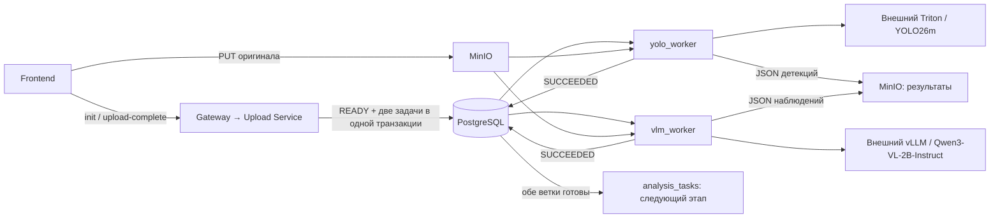

# lct_2026

Приложение загружает видео или один/несколько JPG/JPEG/PNG в MinIO и асинхронно обрабатывает каждый файл двумя воркерами: `yolo_worker` вызывает внешний Triton с YOLO26m, `vlm_worker` — внешний vLLM с `Qwen/Qwen3-VL-2B-Instruct`.

## Поток данных



`READY` означает завершённую загрузку. Обработка имеет состояния `QUEUED → RUNNING → SUCCEEDED/FAILED`. Очередь реализована в PostgreSQL; Redis в этом потоке не используется. После обеих успешных веток создаётся одна запись `analysis_tasks` со ссылками на результаты. Потребитель этой очереди для сопоставления с планом/правилами ещё не реализован.

## Запуск

```bash
docker compose up -d --build frontend api_gateway upload_service
```

Frontend: <http://localhost:3000>. Подключения задаются корневым `.env`.

Когда внешние inference-серверы готовы, перенесите нужные параметры из [примера окружения](prom_app/services/media_worker/.env.example) в корневой `.env`. Укажите реальные `TRITON_HTTP_URL`, `VLLM_BASE_URL`, имя/версию модели Triton и имена её тензоров:

```bash
docker compose -f docker-compose.yml -f docker-compose.workers.yml up -d --build yolo_worker vlm_worker
```

Compose-файл воркеров содержит клиентские процессы обработки на CPU. Inference выполняют внешние серверы. Адреса по умолчанию — примеры для Docker Desktop. Пока серверы не готовы, запускайте только приложение загрузки: задачи сохраняются до запуска воркеров.

При локальной проверке готовые образы `minio/minio:latest` и `minio/mc:latest` не скачивались. Если используете собранные локальные образы, подключайте соответствующий Compose override; это отдельная настройка инфраструктуры.

## Документация

- [Воркеры, контракты моделей и следующий этап](docs/INFERENCE.md)
- [Сервис воркеров и тесты](prom_app/services/media_worker/README.md)
- [Контракт загрузки HTTP](API-Specification.md)
- [Сервисы](prom_app/services/SERVICES.md)
- [PostgreSQL](docs/POSTGRES.md), [MinIO](docs/MinIO.md), [Grafana](docs/GRAFANA.md)
- [Проверка загрузки](INSTRUCTION.md)
- [Архив исходного обсуждения архитектуры](docs/ARCHITECTURE_NOTES.md)
