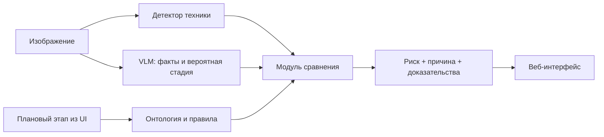
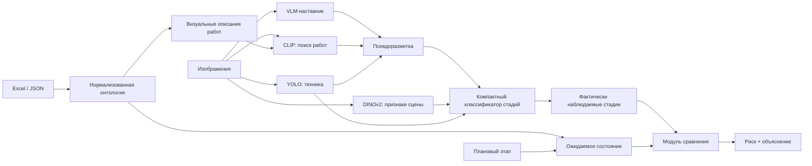
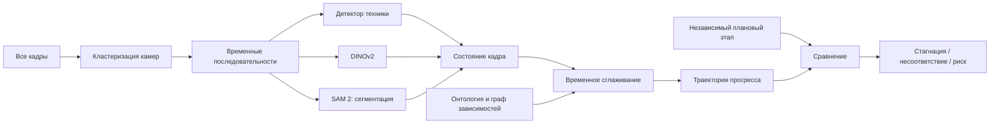
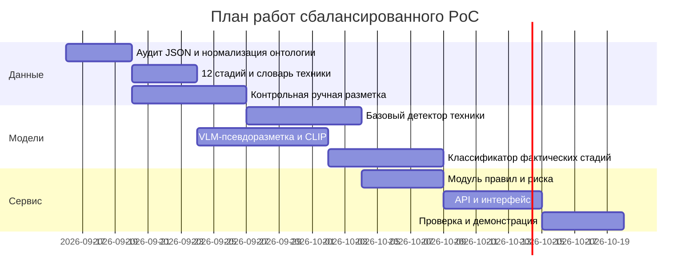

# Глубокое исследование проекта «Автоматизированный сервис поиска нарушений на строительных площадках Москвы»

[Скачать полный отчёт в формате Markdown](sandbox:/mnt/data/Исследование_PoC_строительные_площадки_Москвы.md)

## Краткое резюме

Имеющийся набор данных **достаточен для построения убедительного PoC**, который обнаруживает строительную технику, оценивает фактически наблюдаемую стадию работ, сопоставляет её с заданным плановым этапом и формирует объяснимый риск снижения темпа. Однако текущие данные принципиально не позволяют доказательно вычислять «фактическое отставание от календарного плана на N дней»: в предоставленном справочнике нет плановых дат начала/окончания, привязки к объектам и зонам, а изображения не имеют готовых `site_id`, `camera_id` и `work_id`. Это ограничение следует из самой структуры кейса и неоднократно фиксировалось в исходном обсуждении. fileciteturn0file5

Предоставленная JSON-онтология уже существенно улучшает ситуацию: она содержит **377 технологических карточек**, определения технологических категорий, оценки наблюдаемости внешней камерой, возможную технику, визуальные признаки и зависимости. При этом сама политика разметки прямо указывает, что календарные даты и длительности не назначены, а сведения о технологии, технике, наблюдаемости и зависимостях являются экспертной интерпретацией исходных названий работ, а не проектными фактами конкретной стройки. fileciteturn0file1

Следовательно, правильная архитектура должна жёстко разделить:

```text
ПЛАН
Что должно происходить
по независимому источнику
        │
        │
        ▼
┌─────────────────┐
│ Модуль сравнения│
└─────────────────┘
        ▲
        │
        │
ФАКТ
Что реально наблюдается
на изображении
```

Ключевой логический момент: **нельзя сначала определить этап из фотографии, а затем по этой же фотографии доказать, что площадка соответствует плану**. Такая система проверит только внутреннюю согласованность сцены, но не календарный план. Поэтому в PoC плановый этап должен задаваться независимо — например, оператором в интерфейсе. В будущей промышленной версии тот же параметр должен приходить из реального календарного плана.

Практика автоматизированного строительного мониторинга подтверждает именно такое разделение: компьютерное зрение используется для извлечения фактического состояния, после чего оно привязывается к проектной/BIM-модели и сравнивается с независимым графиком. В многокамерной работе ISARC 2024 сначала распознаётся текущий прогресс, затем информация интегрируется в BIM и только после этого сравнивается с графиком. citeturn9search0turn9search2 Аналогично, исследования на видео стройплощадок объединяют детекцию, сегментацию, трекинг и временную информацию, а извлечённые состояния затем передают в BIM. citeturn9search3

Для имеющихся примерно 100 изображений **нецелесообразно дообучать большую визуально-языковую модель целиком**. Рациональнее использовать большую визуально-языковую модель как модель-наставник для псевдоразметки, DINOv2 как замороженную модель визуальных признаков, CLIP — для поиска наиболее подходящих технологических карточек, а YOLO — как отдельный детектор техники. DINOv2 официально позиционируется как источник универсальных визуальных признаков, пригодных для использования даже с простыми линейными классификаторами без обязательного дообучения всей основы. citeturn7search1 CLIP создаёт совместное пространство изображения и текста и позволяет ранжировать текстовые описания относительно изображения. citeturn7search2turn7search4

**Моя итоговая рекомендация — «Сбалансированный PoC»:**

```text
Изображение
    │
    ├──→ YOLO → обнаруженная техника
    │
    ├──→ DINOv2 → признаки всей сцены
    │
    └──→ VLM-наставник → псевдоразметка
                         │
Онтология → CLIP ────────┤
                         ▼
             классификатор стадий
                         │
                         ▼
                 фактический этап

Плановый этап ───────────┐
                        ▼
            правила «этап → техника»
                        │
Фактический этап ────────┼──→ сравнение
Обнаруженная техника ────┘
                        │
                        ▼
        риск + причина + доказательства
```

Конечный результат текущего PoC следует формулировать как **«риск снижения темпа / риск потенциального отставания»**, а не как «объект точно опаздывает на 17 дней».

В исследовании учтены предоставленный полный контекст обсуждения, JSON-онтология и ранее сформированные аналитические материалы. fileciteturn0file5 fileciteturn0file1 fileciteturn0file0 fileciteturn0file2 fileciteturn0file3 fileciteturn0file4

## Исходные данные, предположения и карта проблем

Исходный Excel — это **справочник видов работ**, а не календарный график. JSON-онтология содержит по одной карточке для каждой непустой строки исходного списка — всего 377 карточек. В политике разметки отдельно указано, что идентификаторы `work_NNN` построены по номеру строки Excel, поскольку часть значений исходного столбца с кодами Excel интерпретирует как числа с форматом даты; календарные даты, длительности и интервалы ожидания в онтологии не назначались. fileciteturn0file1

По моему программному анализу предоставленного JSON:

| Характеристика | Значение |
|---|---:|
| Всего технологических карточек | 377 |
| Карточек типа `ITEM` | 329 |
| Агрегирующих карточек | 48 |
| Исходных технологических категорий | 36 |
| Наблюдаемость внешней камерой = 0 | 60 |
| Низкая наблюдаемость `0 < x < 0,5` | 96 |
| Средняя наблюдаемость `0,5 ≤ x < 0,75` | 72 |
| Высокая наблюдаемость `x ≥ 0,75` | 149 |
| Средняя оценка наблюдаемости | ≈ 0,49 |
| Медиана наблюдаемости | 0,60 |
| `required_equipment = UNKNOWN` | 167 |
| Пустой список обязательной техники | 198 |
| Непустой список обязательной техники | **12** |

Последняя строка особенно важна: **существующая онтология ещё не является готовым справочником правил «работа → обязательная техника»**. Она специально размечена консервативно: для многих работ универсально обязательный набор машин нельзя определить только по названию работы, поэтому используется `UNKNOWN` или пустой список. fileciteturn0file1

Например, карточка `work_047` — «Устройство котлована» — имеет технологическую категорию `EARTHWORKS`, наблюдаемость внешней камерой `0.9`, обязательную технику `UNKNOWN`, а в возможной технике перечислены экскаватор, бульдозер, самосвал и водоотливной насос. Аналогично у «Устройства свай» и «Устройства фундамента» обязательный комплект в исходной онтологии не объявлен универсальным. fileciteturn0file1

Это означает, что для PoC требуется **отдельный операционный набор правил**, в котором будет явно зафиксировано:

```text
исходная карточка
    │
    ├── что известно из исходного JSON
    │
    └── что мы ДОБАВИЛИ специально для PoC
            │
            ├── условие применимости
            ├── ожидаемая техника
            ├── веса
            └── статус экспертной проверки
```

Ключевые проблемы и нюансы кейса:

- **Нет реального календарного плана.** Невозможно независимо определить, какой вид работ должен выполняться в конкретную дату.
- **Технологический граф не равен календарному графику.** Связь «котлован → фундамент → каркас» задаёт порядок, но не отвечает на вопрос, что должно выполняться 15 июля.
- **Восстановленный из изображений график не является независимым эталоном.** Если из кадров построить «план», а затем теми же кадрами проверять этот план, возникает логическая цикличность.
- **Нет готового соответствия `изображение → работа`.** Значит, нет эталонных целевых меток для обучения модели стадий.
- **Нет `camera_id`.** Нельзя сразу понять, какие снимки относятся к одному ракурсу.
- **Нет `site_id`.** Нельзя доказать, что два похожих ракурса относятся к одной стройке.
- **Нет явной зоны видимости камеры.** Машина может существовать на объекте, но не попадать в кадр.
- **Тип здания для каждого снимка не указан.** Поэтому столбцы «Жильё», «Образование», «Здравоохранение» и т. д. нельзя применять автоматически.
- **Всего около 100 собственных изображений.** Этого недостаточно для обучения крупной модели с нуля.
- **Нет эталонных ограничивающих рамок техники.** Без ручной контрольной выборки нельзя объективно оценить качество детектора.
- **377 работ слишком детальны для внешней камеры.** Многие внутренние инженерные и отделочные процессы просто не видны.
- **Многие исходные работы являются агрегирующими разделами.** Они не должны автоматически становиться классами модели.
- **Текущий формат обязательной техники неоднороден.** Строка `UNKNOWN`, пустой массив и непустой массив должны иметь разные смысловые статусы.
- **Нет единой канонической таксономии техники.** Например, `кран`, `автокран`, `башенный кран`, `кран-манипулятор` нельзя смешивать без иерархии.
- **Одна машина соответствует множеству работ.** Экскаватор встречается на котловане, сетях, вертикальной планировке, благоустройстве.
- **Несколько работ могут выполняться одновременно.** Значит, стадия должна быть многометочной.
- **Отсутствие техники на одном кадре — слабое доказательство.** Машина может находиться за пределами обзора, в рейсе или быть пропущена моделью.
- **Дата может присутствовать только визуально.** Нужна обработка timestamp, но имя `Screenshot_49` нельзя принимать за временной порядок.
- **Погодные условия и масштаб объектов сильно меняются.** Снег, туман, окклюзии и удалённость техники ухудшают детекцию.
- **VLM может самоподтверждать предложенные ей этапы.** Если сразу показать ей названия работ, она способна подогнать описание под подсказку.
- **Псевдоразметка содержит систематические ошибки.** Нельзя считать её настоящей эталонной разметкой.
- **Соседние кадры могут создать утечку между train и test.** Почти одинаковые изображения нельзя случайно распределять по выборкам.
- **Нет эталонных меток «отставание».** Поэтому нельзя обучить реальную вероятность задержки.
- **Некоторые классы техники могут встретиться один-два раза.** Возникает сильный дисбаланс.
- **Есть юридико-лицензионный риск используемого стека.** В частности, официальная страница Ultralytics указывает AGPL-3.0 как стандартный вариант и отдельную Enterprise-лицензию для закрытых сценариев, поэтому этот вопрос нужно проверить до промышленного развёртывания. citeturn8search0

Особенно важно не пытаться «решить нейросетью» информационно недоопределённую часть задачи. Исследования строительного мониторинга обычно имеют отдельную проектную/BIM или плановую сущность, с которой сравнивается наблюдаемый факт. citeturn9search0turn9search3 Более того, исследование ISARC 2024, посвящённое работе **без детальной BIM**, отдельно отмечает практические проблемы качества графика, отсутствия формализованных визуально распознаваемых состояний и недостаточной зрелости проектных данных. citeturn9search10 Это очень близко к вашему кейсу.

## Варианты решения проблем

Шкала ниже:

- **Трудоёмкость Н/С/В** — низкая / средняя / высокая.
- **Риск** — вероятность, что решение не даст устойчивого результата.
- **Качество** — ожидаемая полезность для PoC при текущих данных.

Оценки — проектные, не нормативные.

| Проблема | Решение A | Решение B |
|---|---|---|
| Нет календарного плана | Плановый этап выбирает пользователь в UI. **Т: Н; риск: Н; качество: В.** | В будущем получать этап из реального графика через API. **Т: С–В; риск: Н; качество: В.** |
| Технологический граф не задаёт текущий этап | Использовать граф только как ограничения переходов и технологический контекст. **Т: Н; риск: Н; качество: В.** | Создать отдельный демонстрационный план с маркировкой `DEMO`. **Т: Н; риск: С; качество: С.** |
| Цикличность восстановленного графика | Использовать его только для анализа динамики, а не план–факт. **Т: Н; риск: Н; качество: В.** | Восстанавливать по ранней части временного ряда и проверять на отложенной будущей части. **Т: С; риск: С; качество: С–В.** |
| Нет `изображение → работа` | Ручная разметка 100 кадров на 10–15 укрупнённых стадий. **Т: С; риск: Н; качество: В.** | VLM + CLIP + детектор → псевдоразметка → ручная проверка. **Т: С; риск: С; качество: В.** |
| Нет camera/site ID | Для первого PoC анализировать каждый снимок независимо. **Т: Н; риск: Н; качество: С.** | DINOv2 + геометрическое совпадение статичного фона → виртуальные камеры. **Т: С; риск: С; качество: С–В.** |
| Неизвестна зона видимости | Вводить `UNKNOWN` и не считать отсутствие нарушением. **Т: Н; риск: Н; качество: В.** | Ручная маска контролируемой области камеры. **Т: С; риск: Н; качество: В.** |
| Тип здания неизвестен | Выбор типа объекта пользователем. **Т: Н; риск: Н; качество: В.** | VLM определяет предполагаемый тип только как вспомогательный фильтр. **Т: Н; риск: С; качество: С.** |
| Мало изображений | Замороженный DINOv2 + маленькая линейная/MLP-голова. **Т: Н–С; риск: Н; качество: В.** | Дообучать большую VLM целиком. **Т: В; риск: В; качество: Н–С. Не рекомендуется.** |
| Нет bbox-разметки | Вручную разметить 40–60 кадров на 6–10 классов. **Т: С; риск: Н; качество: В.** | Grounding DINO → предварительные рамки → ручная коррекция. **Т: С; риск: С; качество: В.** |
| 377 классов | Свести к ~12 операционным визуальным стадиям. **Т: Н–С; риск: Н; качество: В.** | Иерархия: макроэтап → конкретный `work_id`. **Т: С–В; риск: С; качество: В.** |
| Невидимые работы | `PRESENT / ABSENT / UNKNOWN`. **Т: Н; риск: Н; качество: В.** | Исключить карточки ниже порога наблюдаемости из CCTV-контроля. **Т: Н; риск: Н; качество: С–В.** |
| Неполные правила техники | Создать отдельную таблицу операционных правил. **Т: С; риск: Н; качество: В.** | LLM предлагает правила, инженер утверждает только наиболее значимые. **Т: С; риск: С; качество: В.** |
| Названия техники неоднородны | Канонический справочник с синонимами. **Т: Н; риск: Н; качество: В.** | Иерархия «семейство → подтип». **Т: С; риск: Н; качество: В.** |
| Одна техника на разных работах | Объединять технику с признаками всей сцены. **Т: С; риск: Н; качество: В.** | VLM проверяет только top-K кандидатов стадии. **Т: С; риск: С; качество: В.** |
| Параллельные работы | Многометочная классификация. **Т: Н–С; риск: Н; качество: В.** | Граф зависимостей с разрешёнными параллельными ветвями. **Т: С; риск: С; качество: В.** |
| Машина не видна на одном снимке | Формулировка «не обнаружена на снимке». **Т: Н; риск: Н; качество: В.** | Тревога только после нескольких последовательных кадров. **Т: С; риск: Н; качество: В.** |
| Неполное время | OCR + `timestamp_source` + `confidence`, иначе `NULL`. **Т: Н–С; риск: Н; качество: В.** | Восстанавливать относительный порядок по визуальному прогрессу. **Т: С–В; риск: С–В; качество: С.** |
| Плохая видимость | Оценка качества изображения → при плохом кадре `UNKNOWN`. **Т: Н; риск: Н; качество: В.** | Сегментация + несколько кадров. **Т: В; риск: С; качество: В.** |
| Ошибки VLM | Первый запрос не видит онтологию. **Т: Н; риск: Н; качество: В.** | Несколько независимых запросов/моделей + голосование. **Т: С–В; риск: С; качество: В.** |
| Утечка train/test | Делить по камере/объекту. **Т: Н; риск: Н; качество: В.** | Временной отложенный тест. **Т: Н; риск: Н; качество: В.** |
| Нет GT отставания | Детерминированный индекс риска, не вероятность. **Т: Н; риск: Н; качество: В.** | Синтетические тестовые сценарии план–факт. **Т: Н; риск: С; качество: С–В.** |
| Дисбаланс техники | Сосредоточиться на 6–10 самых значимых классах. **Т: Н; риск: Н; качество: В.** | Добавить внешние датасеты + доразметить собственные кадры. **Т: С; риск: С; качество: В.** |
| Лицензирование | Проверить лицензию до фиксации производственного стека. **Т: Н; риск: Н; качество: В.** | Выбрать альтернативную реализацию с подходящей лицензией. **Т: С; риск: Н; качество: В.** |

### Критически важное решение: два режима системы

Именно здесь снимается основное противоречие постановки.

**Режим контроля плана:**

```text
Изображение
+
плановый этап
        ↓
система сравнивает
план ↔ факт
        ↓
можно говорить
о несоответствии плану
```

**Режим автоматического анализа сцены:**

```text
Изображение
        ↓
техника + фактическая стадия
        ↓
согласованность сцены
и ресурсной модели
```

Во втором режиме **нельзя писать «работы идут по плану»**, потому что план не был подан.

### Почему это принципиально

Пусть на снимке виден:

```text
котлован
экскаватор
самосвал
```

Модель определила:

```text
фактический этап:
«Устройство котлована»
```

Если затем мы извлечём из базы:

```text
для котлована:
экскаватор + самосвал
```

и заключим:

```text
всё присутствует → «план выполняется»
```

это логическая ошибка.

Реальный план мог быть:

```text
сегодня уже должен выполняться фундамент
```

Тогда этот же кадр является признаком отставания.

Таким образом:

```text
ФАКТИЧЕСКИЙ ЭТАП
можно определять по изображению.

ПЛАНОВЫЙ ЭТАП
должен приходить независимо.
```

Это один из наиболее важных архитектурных выводов всего исследования.

## Варианты реализации PoC

**Минимальный PoC.**

Цель — за 1–2 недели продемонстрировать полный бизнес-сценарий без попытки обучить сложную систему.



Компоненты:

```text
изображение
   │
   ├─ предобученный детектор
   │      └─ техника + рамки
   │
   └─ VLM
          └─ описание сцены
             + вероятная фактическая стадия

выбранный плановый этап
   │
   └─ база правил
          │
          ▼
     сравнение
          │
          ▼
     предупреждение
```

Grounding DINO можно применять для быстрого открытого поиска техники по текстовым запросам: официальная реализация принимает пару «изображение + текст» и выдаёт ограничивающие рамки для указанных понятий. citeturn8search1turn8search2 Для финального закрытого набора классов можно использовать YOLO. Инструменты Ultralytics позволяют обучать и валидировать детектор и получать mAP50–95, mAP50, precision, recall и F1. citeturn7search5

**Вход API:**

```json
{
  "planned_stage_id": "OP_02_EXCAVATION",
  "building_type": "housing",
  "mode": "plan_compliance"
}
```

Плюс файл изображения.

**Выход API:**

```json
{
  "observed_equipment": [
    {
      "type": "excavator",
      "count": 3,
      "confidence": 0.93
    }
  ],
  "observed_stage": {
    "stage_id": "OP_02_EXCAVATION",
    "confidence": 0.81
  },
  "missing_expected_equipment": [
    "dump_truck"
  ],
  "risk": {
    "score": 0.61,
    "level": "HIGH",
    "confidence": 0.72
  }
}
```

**Таблицы:** `frames`, `frame_objects`, `work_ontology`, `violations`. `frame_work_labels` нужен только для ручной проверки, `reconstructed_schedule` пока не используется.

**Минимальные данные:** текущие 100 изображений + JSON-онтология.

**Желательно:** 20–30 вручную проверенных изображений, 20–30 утверждённых правил по наиболее полезным работам.

**Оценка ресурсов:**

| Параметр | Оценка |
|---|---:|
| Человеко-часы | 90–140 |
| GPU-часы | 0–20 |
| Хранилище | 2–5 ГБ |
| Срок | 1–2 недели |
| Команда | 1 ML + 1 full-stack частично |

GPU практически не нужен, если VLM вызывается через API и детектор не дообучается.

**Минимальная демонстрация UI:**

```text
┌────────────────────────────────────────────┐
│ Плановый этап                              │
│ [ Устройство котлована              ▼ ]   │
│                                            │
│ [ Загрузить изображение ]                 │
└────────────────────────────────────────────┘

┌──────────── изображение ──────────────────┐
│ [bbox] Экскаватор 0.94                    │
│ [bbox] Экскаватор 0.89                    │
└────────────────────────────────────────────┘

План:
Устройство котлована

Факт:
Экскаватор × 2
Самосвал не обнаружен

Оценка:
⚠ Высокий риск снижения темпа

Причина:
На снимке не обнаружена техника,
ожидаемая для вывоза грунта.
```

**Сбалансированный PoC — рекомендуемый.**

Этот вариант уже создаёт собственный слой распознавания фактической стадии и не зависит от VLM на каждом промышленном запросе.



Рекомендуемый набор:

- **YOLO** — закрытый набор 6–10 типов строительной техники.
- **DINOv2** на основе ViT — векторное представление всей сцены.
- **CLIP** — поиск наиболее подходящих технологических карточек.
- **Qwen2.5-VL** или аналогичная сильная VLM — модель-наставник для офлайн-разметки.
- **небольшая MLP/линейная голова** — многометочная классификация стадий.
- **модуль правил** — сопоставление планового этапа и техники.

Официальный DINOv2 предоставляет предобученные визуальные признаки, которые разработчики прямо демонстрируют с k-NN, логистической регрессией и линейными классификаторами; это соответствует ситуации с маленьким датасетом гораздо лучше, чем обучение крупной модели с нуля. citeturn7search1

CLIP умеет кодировать изображения и текст в совместное пространство и выдавать косинусное сходство между ними, что удобно для поиска top-K карточек по визуальному смыслу. citeturn7search2

Qwen2.5-VL поддерживает структурированный JSON-вывод, локализацию объектов рамками/точками и анализ временных событий, поэтому хорошо подходит именно как офлайн-модель-наставник. citeturn9search1

**Detectron2** имеет смысл рассматривать как альтернативный исследовательский стек, если понадобятся Mask R-CNN, экземплярная или паноптическая сегментация. Официальный проект поддерживает Mask/Cascade R-CNN, DeepLab, ViTDet, PointRend и другие архитектуры. Для простой детекции техники в первом PoC YOLO проще, поэтому Detectron2 я бы не ставил в основной путь. citeturn8search4

Для узкоспециализированных строительных объектов универсальный открытый детектор лучше воспринимать как инструмент предварительной разметки, а не автоматически как финальную production-модель: исследование 2025 года по строительным MEP-элементам показало, что дообученные лёгкие закрытые детекторы в специализированном окружении в целом превосходили исследованные open-vocabulary модели. citeturn9academia49

**API:**

```text
POST /v1/analyze
POST /v1/batch/analyze
GET  /v1/frames/{frame_id}
GET  /v1/ontology/{work_id}
```

Два режима:

```json
{
  "mode": "plan_compliance",
  "planned_stage_id": "OP_04_FOUNDATION"
}
```

или:

```json
{
  "mode": "scene_analysis",
  "planned_stage_id": null
}
```

В `scene_analysis` поле соответствия плану обязано быть `null`.

**Офлайн-подготовка:**

```text
Excel / JSON
    ↓
нормализация
    ↓
12 операционных стадий
    ↓
визуальные сигнатуры
    ↓

100 изображений
    │
    ├─ Grounding DINO → предварительные bbox
    ├─ VLM → описание сцены
    ├─ CLIP → top-K работ
    └─ человек → контрольная проверка
                 ↓
          псевдоразметка
                 ↓
        обучение собственной
         компактной модели
```

**Минимальные данные:** нынешние 100 кадров.

**Желательные:** 40–60 кадров с проверенными bbox по технике и все 100 кадров с проверенной укрупнённой стадией.

**Ресурсы:**

| Параметр | Оценка |
|---|---:|
| Человеко-часы | 260–380 |
| GPU-часы | 40–100 |
| GPU | около 24 ГБ достаточно |
| Хранилище | 10–30 ГБ |
| Срок | 4–6 недель |
| Команда | 2 ML/CV + 1 full-stack |

**Амбициозный PoC.**

Добавляются виртуальные камеры, временные последовательности, сегментация и анализ динамики.



SAM 2 — единая модель сегментации изображений и видео с памятью по видеопоследовательности; она может поддерживать маски объектов между кадрами и корректироваться дополнительными подсказками. Это делает её полезной для измерения площади фасада, грунта или дорожного покрытия при стабильном ракурсе камеры. citeturn7search0turn7search3

Исследования строительного мониторинга уже объединяют детекцию, экземплярную сегментацию, трекинг и временную информацию из камер. citeturn9search3 Многокамерные подходы дополнительно связывают разные ракурсы с проектной моделью, прежде чем сравнивать их с планом. citeturn9search0

**Дополнительные функции:**

```text
camera_cluster_id
sequence_id
first_seen
last_seen
stage_transition
progress_delta
stagnation_score
```

**API:**

```text
GET /v1/sites/{id}/timeline
GET /v1/cameras/{id}/frames
GET /v1/violations?from=...&to=...
```

**Офлайн:**

```text
DINOv2-сходство кадров
        ↓
локальное геометрическое совпадение
        ↓
виртуальные камеры
        ↓
OCR даты
        ↓
временные ряды
        ↓
детекция + сегментация
        ↓
временное сглаживание
```

**Ресурсы:**

| Параметр | Оценка |
|---|---:|
| Человеко-часы | 550–850 |
| GPU-часы | 150–350 |
| Хранилище | 30–100 ГБ |
| Срок | 8–12 недель |
| Команда | 3–4 человека |

Главный риск амбициозного варианта — не модели, а **качество восстановления структуры данных**, которой первоначально нет.

**Сравнение трёх вариантов:**

| Характеристика | Минимальный | Сбалансированный | Амбициозный |
|---|---|---|---|
| Детекция техники | Да | Да, дообученная | Да |
| Автоматическая стадия | VLM | Собственная модель | Собственная + временная |
| План–факт | Ручной плановый этап | Ручной/внешний | Ручной/внешний |
| Псевдоразметка | Минимально | Да | Да |
| CLIP | Необязательно | Да | Да |
| DINOv2 | Необязательно | Да | Да |
| SAM 2 | Нет | Опционально | Да |
| Временная динамика | Нет | Частично | Да |
| Восстановление камер | Нет | Опционально | Да |
| Стагнация | Нет | Ограниченно | Да |
| Риск реализации | Низкий | **Средний** | Высокий |
| Рекомендация | Быстрый демо | **Основной выбор** | Исследовательское расширение |

## Онтология, технологическая карточка и структура данных

Главный принцип: **не переписывать экспертную онтологию так, будто сгенерированные LLM правила являются исходными фактами**.

Например, исходная карточка `work_047 «Устройство котлована»` имеет:

```text
macro_stage = EARTHWORKS
external_camera_observability = 0.90
required_equipment = UNKNOWN

optional_equipment:
- Экскаватор
- Бульдозер
- Самосвал
- Водоотливной насос
```

fileciteturn0file1

Если для PoC мы хотим использовать правило:

```text
котлован
→ экскаватор обязателен
→ самосвал ожидается при вывозе грунта
```

нужно хранить его **отдельно от исходной карточки**.

Рекомендуемый формат технологической карточки:

```json
{
  "work_id": "work_047",
  "work_name": "Устройство котлована",
  "row_kind": "ITEM",

  "macro_stage_source": "EARTHWORKS",

  "external_camera_observability": 0.90,

  "source_annotation": {
    "required_equipment_status": "UNKNOWN",
    "required_equipment": [],
    "optional_equipment": [
      "excavator",
      "bulldozer",
      "dump_truck",
      "dewatering_pump"
    ]
  },

  "visual_signature": {
    "positive_signs": [
      "видимая выемка ниже исходной поверхности",
      "работа землеройной техники внутри или у границы выемки",
      "перемещение или складирование грунта"
    ],
    "negative_signs": [],
    "absence_is_conclusive": false
  },

  "operational_rule": {
    "status": "PROPOSED",
    "review_status": "NEEDS_EXPERT_REVIEW",

    "conditions": [
      "механизированная разработка грунта",
      "грунт вывозится за пределы контролируемой зоны"
    ],

    "required_equipment": [
      {
        "equipment_id": "excavator",
        "weight": 0.55,
        "critical": true
      },
      {
        "equipment_id": "dump_truck",
        "weight": 0.35,
        "critical": false
      }
    ],

    "optional_equipment": [
      {
        "equipment_id": "bulldozer",
        "weight": 0.10
      }
    ]
  },

  "dependencies": {
    "predecessors": [],
    "successors": []
  },

  "provenance": {
    "source_card": "work_047",
    "rule_origin": "LLM_PROPOSAL_PLUS_HUMAN_REVIEW",
    "calendar_facts_added": false
  }
}
```

### Правила проверки качества онтологии

**Типизация.** Текущее поле `required_equipment` желательно нормализовать. Вместо:

```json
"required_equipment": "UNKNOWN"
```

и в других карточках:

```json
"required_equipment": []
```

лучше:

```json
{
  "required_equipment_status": "UNKNOWN",
  "required_equipment": []
}
```

Допустимые статусы:

```text
UNKNOWN
NO_UNIVERSAL_REQUIRED
KNOWN
```

**Ссылочная целостность.**

Каждый:

```text
predecessor.work_id
successor.work_id
```

должен существовать в онтологии.

**Канонизация техники.**

Необходимо иметь:

```text
crane
 ├── tower_crane
 ├── mobile_crane
 └── manipulator_crane

excavator
 ├── crawler_excavator
 └── wheeled_excavator
```

Тогда модель может детектировать конкретный подтип, а правило — требовать семейство.

**Наблюдаемость.**

При:

```text
external_camera_observability < 0.25
```

нельзя превращать:

```text
не видно
```

в:

```text
ABSENT
```

По политике исходной онтологии отсутствие визуального признака само по себе не доказывает отсутствие работы. fileciteturn0file1

**Агрегирующие карточки.**

`row_kind = AGGREGATE` не использовать как точный target без явной причины.

**Правила техники.**

Нельзя допускать одну и ту же машину одновременно в:

```text
required_equipment
optional_equipment
```

одного правила.

**Условия.**

Правило обязательно должно поддерживать:

```json
{
  "condition": "...",
  "applies_when": "...",
  "does_not_apply_when": "..."
}
```

Например:

```text
самосвал для котлована
```

не универсально обязателен, если грунт временно складируется внутри площадки.

**Происхождение.**

У каждого LLM-добавления:

```text
model_name
prompt_version
created_at
review_status
reviewer
source
```

**Календарные данные.**

LLM запрещено генерировать:

```text
planned_start
planned_finish
duration_days
```

если они не присутствуют в независимом источнике.

### Рекомендуемые таблицы

```sql
CREATE TABLE frames (
    frame_id TEXT PRIMARY KEY,
    image_uri TEXT NOT NULL,

    captured_at TIMESTAMPTZ NULL,
    timestamp_source TEXT NOT NULL DEFAULT 'UNKNOWN',
    timestamp_confidence REAL NULL,

    site_id TEXT NULL,
    camera_id TEXT NULL,
    camera_cluster_id TEXT NULL,

    building_type TEXT NULL,
    image_quality REAL NULL,

    created_at TIMESTAMPTZ NOT NULL DEFAULT now()
);
```

```sql
CREATE TABLE frame_objects (
    object_id BIGSERIAL PRIMARY KEY,

    frame_id TEXT NOT NULL
        REFERENCES frames(frame_id),

    equipment_type TEXT NOT NULL,

    bbox_xyxy JSONB NOT NULL,

    confidence REAL NOT NULL,
    model_name TEXT NOT NULL
);
```

```sql
CREATE TABLE work_ontology (
    work_id TEXT PRIMARY KEY,

    source_row INT NULL,
    work_name TEXT NOT NULL,
    row_kind TEXT NOT NULL,

    macro_stage TEXT NOT NULL,

    observability REAL NOT NULL,

    required_equipment_status TEXT NOT NULL,
    required_equipment JSONB NOT NULL,
    optional_equipment JSONB NOT NULL,

    visual_signs JSONB NOT NULL,

    predecessors JSONB NOT NULL,
    successors JSONB NOT NULL,

    provenance JSONB NOT NULL
);
```

```sql
CREATE TABLE frame_work_labels (
    id BIGSERIAL PRIMARY KEY,

    frame_id TEXT NOT NULL
        REFERENCES frames(frame_id),

    work_id TEXT NOT NULL
        REFERENCES work_ontology(work_id),

    state TEXT NOT NULL
        CHECK (state IN (
            'PRESENT',
            'ABSENT',
            'UNKNOWN'
        )),

    confidence REAL NOT NULL,

    evidence JSONB NOT NULL,

    label_source TEXT NOT NULL,

    reviewed BOOLEAN NOT NULL DEFAULT FALSE
);
```

```sql
CREATE TABLE reconstructed_schedule (
    id BIGSERIAL PRIMARY KEY,

    site_cluster_id TEXT NOT NULL,

    work_id TEXT NOT NULL
        REFERENCES work_ontology(work_id),

    estimated_start TIMESTAMPTZ NULL,
    estimated_finish TIMESTAMPTZ NULL,

    confidence REAL NOT NULL,

    source TEXT NOT NULL
        CHECK (
            source IN (
                'RECONSTRUCTED',
                'OFFICIAL',
                'DEMO'
            )
        )
);
```

```sql
CREATE TABLE violations (
    violation_id BIGSERIAL PRIMARY KEY,

    frame_id TEXT
        REFERENCES frames(frame_id),

    planned_stage_id TEXT NULL,

    violation_type TEXT NOT NULL,

    severity TEXT NOT NULL,

    risk_score REAL NULL,
    risk_confidence REAL NOT NULL,

    expected_state JSONB NOT NULL,
    observed_state JSONB NOT NULL,

    evidence JSONB NOT NULL,

    created_at TIMESTAMPTZ NOT NULL DEFAULT now()
);
```

Дополнительно я бы создал:

```sql
CREATE TABLE stage_equipment_rules (
    rule_id TEXT PRIMARY KEY,

    stage_id TEXT NOT NULL,

    equipment_id TEXT NOT NULL,

    requirement_type TEXT NOT NULL,

    weight REAL NOT NULL,

    condition_text TEXT NULL,

    rule_confidence REAL NOT NULL,

    review_status TEXT NOT NULL,

    provenance JSONB NOT NULL
);
```

### Пример API сбалансированного варианта

Запрос:

```json
{
  "frame_id": "Screenshot_100",

  "captured_at": "2024-01-21T10:00:00+03:00",

  "site_id": null,
  "camera_id": null,

  "building_type": "housing",

  "planned_stage_id": "OP_02_EXCAVATION",

  "mode": "plan_compliance"
}
```

Ответ:

```json
{
  "observed_equipment": [
    {
      "type": "excavator",
      "count": 3,
      "confidence": 0.93
    },
    {
      "type": "crane",
      "count": 2,
      "confidence": 0.86
    }
  ],

  "observed_stages": [
    {
      "stage_id": "OP_02_EXCAVATION",
      "probability": 0.84
    },
    {
      "stage_id": "OP_03_PILING",
      "probability": 0.62
    }
  ],

  "planned_stage_id": "OP_02_EXCAVATION",

  "equipment_coverage": 0.62,

  "violations": [
    {
      "type": "MISSING_EXPECTED_EQUIPMENT",
      "equipment": "dump_truck",
      "statement": "Самосвал не обнаружен на текущем снимке"
    }
  ],

  "risk": {
    "score": 0.58,
    "level": "HIGH",
    "confidence": 0.74,
    "interpretation":
      "риск снижения темпа, а не подтверждённая просрочка"
  }
}
```

Если:

```json
"mode": "scene_analysis"
```

то:

```json
"planned_stage_id": null
```

и система **не должна генерировать `STAGE_MISMATCH` относительно плана**.

## Псевдоразметка и офлайн-подготовка

Псевдоразметку нужно строить как **ансамбль независимых источников**, а не один ответ VLM.

```text
                    изображение
                        │
          ┌─────────────┼───────────────┐
          │             │               │
          ▼             ▼               ▼
         VLM           CLIP         детектор
     факты сцены   поиск работ      техника
          │             │               │
          └─────────────┼───────────────┘
                        ▼
                 согласование
                        │
                        ▼
                 псевдоразметка
                        │
              ┌─────────┴───────────┐
              ▼                     ▼
     высокая уверенность        спорные случаи
              │                     │
              ▼                     ▼
         обучение              ручная проверка
```

Для подготовки рамок Grounding DINO удобен именно тем, что выполняет детекцию открытого словаря по тексту. citeturn8search1 Но финальную оценку качества всё равно нужно делать на вручную размеченной выборке. Специализированные закрытые детекторы в узких строительных задачах могут существенно превосходить универсальные модели. citeturn9academia49

### Проход фактического наблюдения

VLM не знает Excel и не видит названия работ.

Промпт:

```text
Проанализируй только то,
что непосредственно видно на изображении.

Не называй этап строительных работ.

Не делай вывод о соблюдении плана.

Не предполагай наличие объектов,
которых не видно.

Верни строго JSON:

{
  "visible_equipment": [
    {
      "type": "...",
      "count": 0,
      "confidence": 0.0,
      "evidence": "..."
    }
  ],

  "scene_features": [],

  "building_state": {
    "aboveground_structure": "...",
    "facade": "...",
    "roof": "..."
  },

  "site_state": {
    "excavation": "...",
    "bare_soil": "...",
    "paving": "...",
    "landscaping": "..."
  },

  "visibility_issues": [],

  "uncertain_observations": []
}
```

Это уменьшает эффект:

```text
«мне подсказали этап → я нашёл его на картинке»
```

### Проход структурирования

Второй запрос работает уже с фактическим описанием:

```text
Преобразуй наблюдения
в структурированное состояние стройплощадки.

Для каждого признака используй:

PRESENT
ABSENT
UNKNOWN

ABSENT разрешён только если объект
или признак должен быть видим
в данной части изображения.

Не добавляй календарные факты.

Верни JSON по заданной схеме.
```

### Поиск подходящих работ

Для каждой карточки создаётся краткая текстовая визуальная сигнатура.

Например:

```text
Устройство котлована:

- крупная открытая выемка;
- работа экскаваторов ниже уровня земли;
- перемещение грунта;
- временные откосы или ограждение;
- надземный каркас отсутствует
  либо находится на ранней стадии.
```

CLIP кодирует изображение и тексты в совместное пространство, поэтому можно получить:

```text
top-K кандидатов
```

например:

```text
work_047 Устройство котлована     0.87
work_064 Земляные работы         0.82
work_049 Устройство основания    0.61
...
```

CLIP действительно поддерживает кодирование изображения/текста и сравнение их косинусного сходства. citeturn7search2 Но эти значения **не следует интерпретировать как откалиброванные вероятности**.

### Детекция техники

Сначала:

```text
Grounding DINO
    ↓
автопредразметка
```

Затем:

```text
40–60 кадров
    ↓
ручная коррекция bbox
```

После этого:

```text
YOLO
    ↓
дообучение на закрытых классах
```

Рекомендуемые первые классы:

```text
excavator
dump_truck
tower_crane
mobile_crane
piling_or_drilling_rig
concrete_mixer
loader
bulldozer
road_roller
paver
```

Не стоит начинать с 30–50 типов машин.

### Проход проверки кандидатов

VLM получает:

```text
изображение
+
фактическое описание
+
top 5–10 работ
```

Промпт:

```text
Ниже приведены кандидаты из справочника.

Для каждого кандидата укажи:

PRESENT
ABSENT
UNKNOWN

Правила:

1. Не выбирай работу только потому,
   что её название похоже на описание.

2. Для PRESENT обязательно укажи
   визуальное доказательство.

3. Если работа может происходить
   внутри здания, за кадром
   или в другой зоне — UNKNOWN.

4. Отсутствие техники
   не доказывает отсутствие работы.

Верни:

work_id
state
confidence
evidence
```

### Объединение источников

Начальная эвристика:

\[
C_{pseudo} =
0.35C_{VLM}
+
0.20C_{retrieval}
+
0.25C_{equipment}
+
0.20C_{temporal}
\]

Где:

- \(C_{VLM}\) — уверенность проверяющего VLM-прохода;
- \(C_{retrieval}\) — **калиброванный ранг**, не сырой cosine similarity;
- \(C_{equipment}\) — согласованность с наблюдаемой техникой;
- \(C_{temporal}\) — согласованность с соседними кадрами.

Если временной информации нет:

```text
C_temporal отсутствует
```

остальные коэффициенты нормируются.

Начальные пороги:

| Значение | Действие |
|---:|---|
| `≥ 0,80` | высокая уверенность, можно использовать для обучения |
| `0,65–0,80` | ручная проверка |
| `< 0,65` | `UNKNOWN`, не обучать как уверенный target |

После получения хотя бы 30–50 вручную проверенных примеров веса лучше **калибровать на данных**, например простой логистической регрессией или изотонической калибровкой, а не оставлять ручными.

### Жёсткие правила агрегации

Если:

```text
observability < 0.25
```

и VLM говорит:

```text
ABSENT
```

результат автоматически:

```text
UNKNOWN
```

Если:

```text
VLM = PRESENT 0.92
детектор = техника противоречит
CLIP = кандидат далеко вне top-K
```

метка уходит в ручную проверку.

Если:

```text
VLM = PRESENT
CLIP = высокий ранг
детектор = согласующаяся техника
временной ряд = логичный переход
```

получаем высокоуверенную псевдометку.

### Временная проверка

Если виртуальные камеры восстановлены:

```text
кадр t-1
кадр t
кадр t+1
```

подаются как единый контекст.

Промпт:

```text
Сравни три кадра одной камеры.

Определи:

persistent_features
new_features
disappeared_features
progress_changes
possible_stage_changes

Не оценивай соблюдение графика.
Не предполагай невидимые работы.
```

Можно проверять:

```text
каркас появился → не должен исчезнуть;
фасад 80% → не должен стать 20%
без смены ракурса;
котлован → фундамент → каркас
логичнее, чем
фасад → котлован.
```

Но временной вывод VLM остаётся вспомогательным: даже современные визуально-языковые модели не следует рассматривать как безошибочный источник временной логики.

### Защита от утечки

Нельзя:

```text
train:
Screenshot_51

test:
Screenshot_52
```

если это соседние снимки одной камеры.

Правильнее:

```text
train:
camera clusters A/B

test:
camera cluster C
```

или:

```text
train:
ранний временной период

validation:
средний

test:
поздний
```

В строительных исследованиях для обучения детекторов используется отдельная размеченная выборка и стандартные precision/recall/F1-метрики; сам факт необходимости специализированной разметки подтверждается и работами по мониторингу прогресса. citeturn9academia47

## Правила «этап → техника», оценка риска и метрики

Ниже приведён **операционный PoC-набор**, а не нормативный технологический документ.

Исходная онтология специально не утверждает универсальную обязательную технику для большинства карточек. fileciteturn0file1 Поэтому каждое приведённое ниже правило должно иметь:

```text
status = PROPOSED

↓

инженерная проверка

↓

status = APPROVED
```

### Рекомендуемые операционные стадии

| Операционный этап | Условно обязательная / ожидаемая техника | Опциональная | Надёжность |
|---|---|---|---|
| Подготовка площадки / демонтаж | При механизированном сносе: экскаватор-разрушитель `0,50`; самосвал `0,30`; погрузчик `0,20` | автокран, пылеподавление | Средняя |
| Земляные работы / котлован | экскаватор `0,55`; самосвал `0,35*` | бульдозер/погрузчик `0,10` | Высокая |
| Ограждение котлована / свайные работы | буровая/сваебойная установка `0,55`; кран `0,25`; экскаватор `0,20` | бетононасос | Высокая при известной технологии |
| Основания и фундаменты | бетононасос `0,35`; автобетоносмеситель `0,30`; кран `0,20`; экскаватор `0,15` | виброплита/каток | Средняя |
| Подземный монолит | кран `0,35`; бетононасос `0,35`; автобетоносмеситель `0,30` | погрузчик | Средне-высокая |
| Надземный каркас / монолит | башенный/мобильный кран `0,40`; бетононасос `0,30`; автобетоносмеситель `0,30` | подъёмник | Высокая для монолита |
| Стены и наружный контур | кран/телескопический погрузчик `0,40`; подъёмник `0,30`; доставка `0,15`; погрузчик `0,15` | леса как визуальный признак | Средняя |
| Кровля | кран `0,45`; подъёмное средство `0,25`; доставка/манипулятор `0,30` | специализированная техника | Низко-средняя |
| Фасад / наружное остекление | фасадный подъёмник/автовышка `0,45`; кран/манипулятор `0,35`; доставка `0,20` | леса, люльки | Средняя |
| Наружные инженерные сети | экскаватор `0,45`; грузовая машина `0,20`; кран/манипулятор `0,20`; ГНБ `0,15*` | насосы, трубоукладчик | Средняя |
| Дорожные работы | каток `0,30`; асфальтоукладчик `0,30*`; самосвал `0,20`; автогрейдер `0,20` | фреза, поливомоечная машина | Высокая для укладки покрытия |
| Благоустройство / завершение | экскаватор/погрузчик `0,35`; самосвал `0,25`; каток/уплотнитель `0,20`; малая механизация `0,20` | озеленительная техника | Средняя |

`*` — только при соответствующей технологии.

Например, самосвал на котловане нельзя объявлять безусловно обязательным, если грунт временно складируется внутри площадки.

### Почему одного списка техники недостаточно

Рассмотрим:

```text
экскаватор
```

Он может соответствовать:

```text
котловану
наружным инженерным сетям
вертикальной планировке
благоустройству
дорожным работам
```

Поэтому должно вычисляться:

\[
P(stage \mid image,\ equipment,\ scene)
\]

а не:

\[
P(stage \mid equipment)
\]

То есть:

```text
техника
+
состояние всего здания
+
состояние территории
+
при наличии — временной контекст
```

### Показатель обеспеченности техникой

Для каждой требуемой машины:

- \(w_i\) — вес;
- \(p_i\) — вероятность/факт обнаружения;
- \(v_i\) — применимость и видимость.

Тогда:

\[
Coverage =
\frac{\sum_i w_i p_i v_i}
{\sum_i w_i v_i}
\]

Пример:

```text
Котлован

Экскаватор:
weight = 0.55
present = 1

Самосвал:
weight = 0.35
present = 0

Бульдозер:
optional
```

Для обязательной части:

\[
Coverage \approx 0.55/(0.55+0.35)=0.61
\]

Но система должна писать:

> «Самосвал не обнаружен на текущем снимке».

Не:

> «На строительной площадке отсутствуют самосвалы».

### Опциональная техника

Опциональное оборудование может давать небольшой бонус:

\[
Bonus_{optional}\leq0.10
\]

но не должно компенсировать отсутствие критической машины.

То есть нельзя получить:

```text
экскаватора нет,
но есть три погрузчика
→ всё нормально
```

если экскаватор является критическим для утверждённого сценария.

### Неожиданная техника

Особенно осторожно нужно работать с:

```text
unexpected_equipment
```

Наличие машины, которой **нет в списке**, ещё не является нарушением.

Например:

```text
план = фундамент
экскаватор на заднем плане
```

не обязательно означает нарушение.

`UNEXPECTED_EQUIPMENT` следует поднимать только если есть сильное технологическое противоречие.

Например:

```text
план:
благоустройство

факт:
сваебойная установка
+
глубокий котлован
+
отсутствующий сформированный объект
```

### Общий индекс риска

Рекомендуемый начальный вариант:

\[
R =
0.45R_{stage}
+
0.35R_{missing}
+
0.10R_{unexpected}
+
0.10R_{inactivity}
\]

Где:

**Несоответствие стадии:**

\[
R_{stage}
=
1-
Compatibility(
planned\_stage,
observed\_stage
)
\]

**Недостающая техника:**

\[
R_{missing}=1-Coverage
\]

**Неожиданная техника:**

```text
R_unexpected
```

используется только при подтверждённом конфликте.

**Низкая активность:**

```text
R_inactivity
```

используется только при наличии нескольких кадров.

Если временного ряда нет:

```text
R_inactivity отсутствует
```

и веса оставшихся компонент нормируются.

### Видимость не должна увеличивать риск

Это принципиально.

Неправильно:

```text
камера плохая
→ не видим технику
→ риск вырос
```

Правильно:

```text
камера плохая
→ уверенность вывода упала
```

Поэтому отдельно:

\[
C_{risk}
=
f(
C_{stage},
C_{detector},
C_{rule},
C_{visibility}
)
\]

Например:

```text
Risk = 0.73

Confidence = 0.31
```

должно приводить к:

```text
ТРЕБУЕТСЯ ПРОВЕРКА
```

а не к критической тревоге.

### Начальная шкала

| Индекс | Уровень |
|---:|---|
| `< 0,25` | Низкий |
| `0,25–0,50` | Средний |
| `0,50–0,75` | Высокий |
| `≥ 0,75` | Критический |

Это **эвристический индекс**, а не статистическая вероятность просрочки.

### Метрики детектора

Использовать:

```text
Precision
Recall
F1
mAP50
mAP50–95
```

Официальная документация Ultralytics предоставляет эти метрики в стандартном процессе валидации. citeturn7search5

Рабочая цель PoC:

```text
Precision ≥ 0.75
Recall    ≥ 0.75
mAP50     ≥ 0.70
```

для ключевых классов.

### Метрики классификации стадий

Поскольку это многометочная задача:

```text
Macro-F1
Micro-F1
F1 по классам
Hamming Loss
Recall@2
```

Не стоит оценивать только accuracy.

Рабочие цели:

```text
Macro-F1 ≥ 0.70
Recall@2 ≥ 0.85
```

### Метрики поиска и псевдоразметки

Для CLIP-поиска:

```text
Recall@5
Precision@5
```

Для псевдометок:

```text
Precision высокоуверенных меток
PR-AUC
ROC-AUC
```

При сильном дисбалансе PR-AUC обычно информативнее для оценки положительного класса.

Рабочая цель:

```text
Precision HIGH-confidence
≥ 0.90
```

### Временная стабильность

Для амбициозного варианта:

```text
label_flip_rate
impossible_transition_rate
adjacent_Jaccard
monotonicity_violation_rate
```

Например:

\[
FlipRate =
\frac{
\#\ смен\ доминирующей\ стадии
}{
\#\ соседних\ пар
}
\]

После сглаживания можно поставить рабочую цель:

```text
невозможные переходы < 5%
```

### Конечные метрики бизнеса

Наиболее важные:

```text
Precision предупреждений
Recall предупреждений
False alerts / 100 frames
Expert acceptance rate
```

Для PoC я бы приоритизировал:

```text
Precision тревог ≥ 0.85
```

потому что система с большим количеством ложных предупреждений быстро потеряет доверие пользователей.

Исследования строительного компьютерного зрения действительно используют стандартные precision, recall и F1 для проверки распознавания элементов, но перенос этих метрик в бизнесовый вывод о графике требует отдельного слоя сопоставления. citeturn9academia47

## Риски, план работ и ключевые выводы

| Риск | Вероятность / ущерб | Как снижать |
|---|---|---|
| Выдать технологический граф за календарный план | Высокая / критический | Разделять `OFFICIAL`, `DEMO`, `RECONSTRUCTED` |
| Проверять кадры против «плана», восстановленного из тех же кадров | Высокая / высокий | Использовать восстановленный график только для динамики или future hold-out |
| Ложные тревоги из-за поля зрения | Высокая / высокий | `UNKNOWN`, зона видимости, несколько кадров |
| Галлюцинации VLM | Средняя / высокий | Первый проход без онтологии, строгий JSON, независимые сигналы |
| Ошибки псевдоразметки | Средняя / высокий | Human review + отдельная тестовая выборка |
| Плохая детекция мелкой техники | Средняя / высокий | Ручной bbox benchmark, высокое разрешение, дообучение |
| Переобучение на одной стройке | Высокая / высокий | Split по камерам/времени, замороженная основа |
| Ошибочные правила техники | Средняя / высокий | `PROPOSED → REVIEWED → APPROVED` |
| Ошибочная группировка камер | Средняя / средний | DINOv2 + геометрическая проверка + ручной контроль |
| Низкая наблюдаемость внутренних работ | Высокая / средний | Не включать в CCTV-покрытие |
| Ошибка интерпретации индекса риска | Высокая / высокий | Отдельно показывать risk и confidence |
| Лицензионные ограничения | Средняя / высокий | Юридическая проверка до production |

По лицензированию особенно важно не считать выбор YOLO нейтральной инженерной деталью: официальная Ultralytics указывает AGPL-3.0 для открытого сценария и Enterprise-вариант для закрытых случаев использования. citeturn8search0 Detectron2, например, распространяется под Apache 2.0, что может быть проще для некоторых архитектурных сценариев, хотя функционально это другой стек. citeturn8search4

### Рекомендуемый план сбалансированного PoC



### Что должно получиться в минимальном MVP-демо

Пользователь открывает страницу и видит:

```text
ПЛАНОВЫЙ ЭТАП

[ Устройство котлована ▼ ]
```

Загружает фотографию.

Система отображает:

```text
ОБНАРУЖЕННАЯ ТЕХНИКА

✓ Экскаватор × 3
✓ Кран × 1
✗ Самосвал не обнаружен
```

Далее:

```text
ФАКТИЧЕСКИ НАБЛЮДАЕМЫЙ ЭТАП

Земляные работы / котлован
уверенность: 84%
```

Сопоставление:

```text
Плановый этап:
Устройство котлована

Фактический этап:
Устройство котлована

Соответствие этапов:
Высокое
```

Но:

```text
Ресурсное соответствие:
61%
```

И объяснение:

> **Предупреждение: высокий риск снижения темпа.**  
> На текущем снимке обнаружены экскаваторы, однако не обнаружены самосвалы, предусмотренные активным ресурсным правилом для вывоза грунта. Отсутствие техники на одном снимке не подтверждает её отсутствие на всей площадке; уверенность предупреждения — 72%.

Другой демонстрационный сценарий:

```text
План:
Фундамент

Факт по изображению:
Котлован / земляные работы
```

Вывод:

> **Несоответствие стадии.** Визуальное состояние площадки больше соответствует более раннему этапу, чем выбранный плановый этап. Возможен риск отставания; необходима проверка инженером.

Это намного сильнее простой демонстрации YOLO, потому что показывает именно **бизнесовую ценность автоматического сопоставления**.

### Ключевые выводы

**Первый.** Текущая таблица и JSON — не календарный план. Это справочник/онтология строительных работ. Полноценный контроль «план–факт» требует независимого планового этапа. fileciteturn0file1

**Второй.** Изображение должно отвечать на вопрос **«что фактически происходит?»**, а не **«что должно происходить?»**. Плановый этап нельзя выводить из того же изображения, если затем требуется проверить соответствие плану.

**Третий.** При отсутствии официального графика самый честный PoC — пользователь выбирает плановый этап вручную. В промышленной архитектуре это поле затем без изменения остального конвейера заменяется данными реального календарного плана.

**Четвёртый.** Восстановленную временную шкалу из кадров полезно использовать для стагнации, последовательности и визуального прогресса, но нельзя выдавать её за официальный план или использовать как независимый эталон для тех же кадров.

**Пятый.** Из 377 исходных работ нужно сформировать около **12 визуально различимых операционных стадий**, а конкретные `work_id` использовать как второй уровень.

**Шестой.** Существующая онтология ценна, но слой обязательной техники пока требует отдельной нормализации и экспертной проверки: только малая доля карточек содержит явный непустой список обязательного оборудования. fileciteturn0file1

**Седьмой.** Большая визуально-языковая модель лучше всего использовать как **офлайн-модель-наставник**, а не дообучать целиком на 100 изображениях. Для собственной модели рациональнее использовать замороженный DINOv2 и маленькую голову. Официальные материалы DINOv2 прямо показывают возможность использования полученных признаков с простыми классификаторами. citeturn7search1

**Восьмой.** CLIP хорошо подходит для предварительного поиска `изображение → top-K технологических карточек`, поскольку совместно кодирует текст и изображения. citeturn7search2

**Девятый.** Grounding DINO целесообразен прежде всего как средство предварительной разметки техники, после чего лучше обучить закрытый детектор на нужных классах. citeturn8search1turn9academia49

**Десятый.** SAM 2 имеет смысл только в более продвинутом варианте, когда требуется измерять изменение площадей фасада, грунта, дорог и отслеживать их между кадрами. citeturn7search0

**Одиннадцатый.** Плохая видимость должна уменьшать **уверенность вывода**, а не увеличивать риск.

**Двенадцатый.** Отсутствие машины на одном снимке необходимо формулировать как:

> «машина не обнаружена на текущем снимке»,

а не:

> «машины на объекте нет».

**Тринадцатый.** Итоговый результат текущего PoC должен называться **«индексом риска снижения темпа / потенциального отставания»**, а не откалиброванной вероятностью фактической просрочки.

**Четырнадцатый.** Наилучший баланс качества, трудоёмкости и исследовательского риска даёт **Сбалансированный PoC**:

```text
YOLO
+
DINOv2
+
VLM-наставник
+
CLIP
+
12 операционных стадий
+
модуль правил
+
независимый плановый этап
```

с оценкой порядка **260–380 человеко-часов и 40–100 GPU-часов**.

**Пятнадцатый.** Эта архитектура не является тупиковым хакатонным решением. Когда появится настоящий календарный план, потребуется заменить только источник:

```text
planned_stage_id
```

из:

```text
ручного выбора пользователя
```

на:

```text
site_id
+
timestamp
+
zone_id
+
официальный календарный план
```

а вся остальная цепочка — детекция техники, распознавание фактической стадии, правила, модуль сравнения, риск и визуализация — останется применимой.

**Основные первичные источники исследования:** официальная документация Ultralytics по детекции и валидации. citeturn7search5turn8search0 Официальные репозитории DINOv2, CLIP, Grounding DINO и Detectron2. citeturn7search1turn7search2turn8search1turn8search4 Официальные материалы Meta по SAM 2 и Qwen по Qwen2.5-VL. citeturn7search0turn9search1 Исследования автоматизированного строительного мониторинга, сопоставления визуальных наблюдений с BIM/графиком и работы в условиях неполной проектной информации. citeturn9search0turn9search3turn9search10turn9academia47